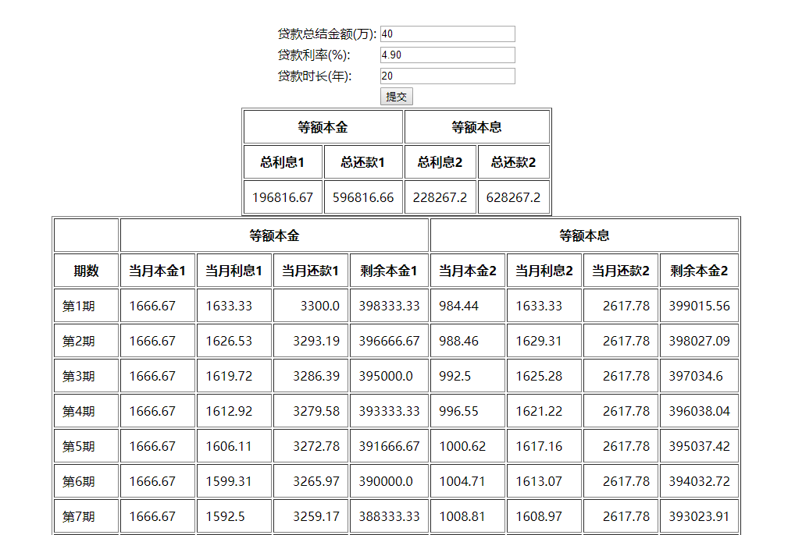

# Mortgage
基于Django的房贷计算小程序
界面丑陋，慎点啊...

安装django环境
```bash
pip install django
```

克隆代码
```bash
git clone git@github.com:hiwanglf/Mortgage.git
```

运行代码到8888端口

```bash
python manage.py runserver 8888
```

在浏览器上访问代码

